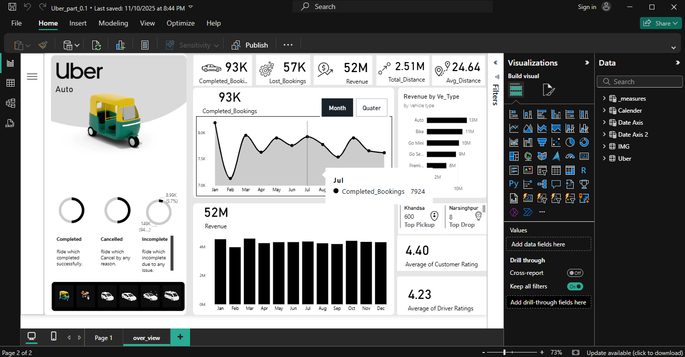

# Uber-Auto-Data-Analysis-Dashboard
Interactive Power BI dashboard analyzing Uber Auto bookings, cancellations, and revenue insights with key metrics like completed rides, lost bookings, total distance, and average driver ratings.
# 🚖 Uber Auto Data Analysis Dashboard

### 🔍 Key Metrics
- **Completed Bookings:** 93K successful rides  
- **Cancelled Bookings:** 57K total  
- **Revenue:** ₹52M generated  
- **Total Distance:** 2.51M km  
- **Average Distance per Ride:** 24.64 km  
- **Customer Rating:** 4.40 ⭐  
- **Driver Rating:** 4.23 ⭐  

---

### 🧩 Dashboard Features
- Monthly and quarterly revenue trends  
- Vehicle-type based analysis (Auto, Go Mini, Bike, etc.)  
- KPIs for completed, cancelled, and incomplete rides  
- Top pickup and drop-off locations  

---

### 🛠️ Tools & Technologies
- **Power BI** for visualization and analysis  
- **Excel** for dataset and preprocessing  
- **DAX** for dynamic measures and KPIs  

---

### 📸 Dashboard Preview

---

### 📂 Files in Repository
| File Name | Description |
|------------|-------------|
| `Uber_part_0.1.pbix` | Power BI dashboard file |
| `uber.xlsx` | Dataset used in the dashboard |
| `uber_overview.png` | Dashboard screenshot |
| `README.md` | Documentation file |

---

### ✨ Author
**Vansh Agarwal**  
📧 [vansgaagrwal2912@gmail.com](mailto:vansgaagrwal2912@gmail.com)  
🌐 [GitHub Profile](https://github.com/vanshagarwal29)
